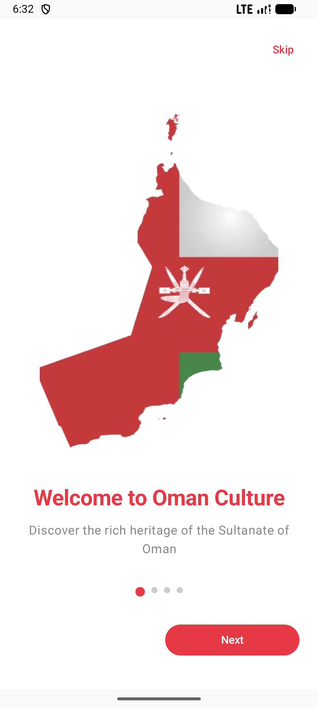
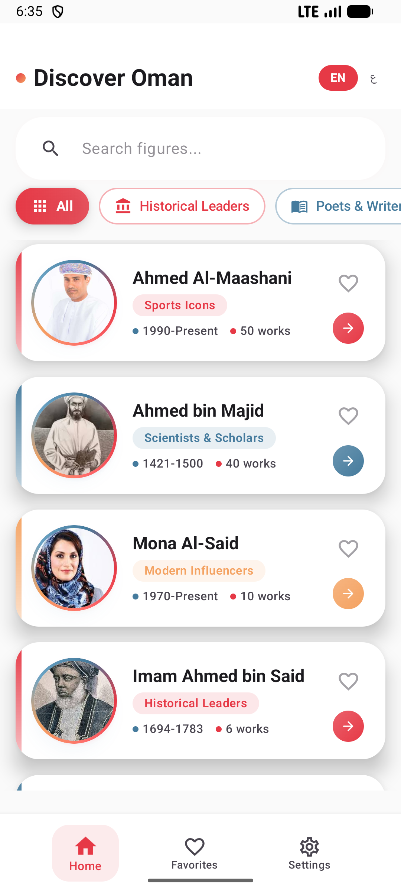
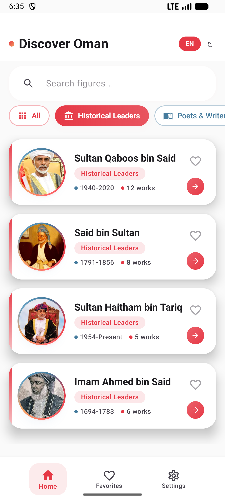
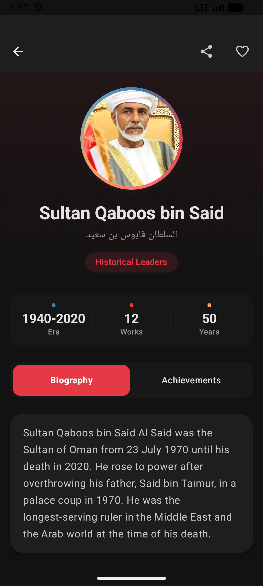
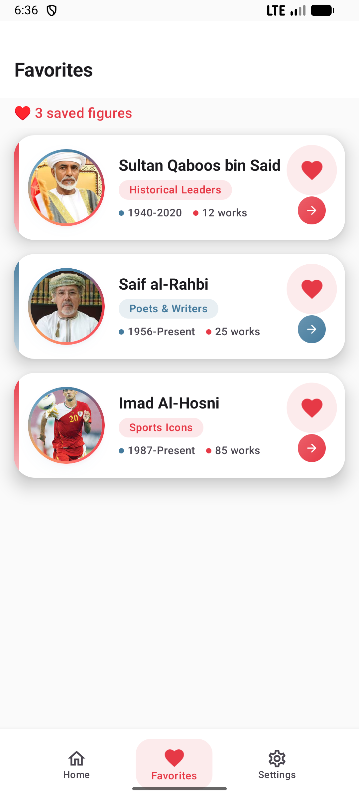
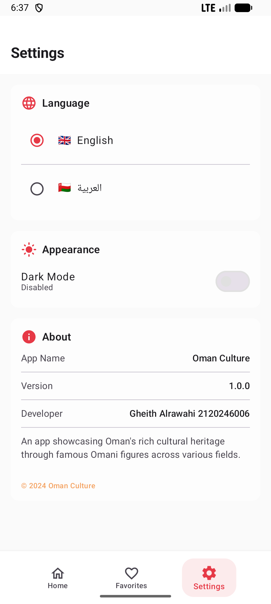
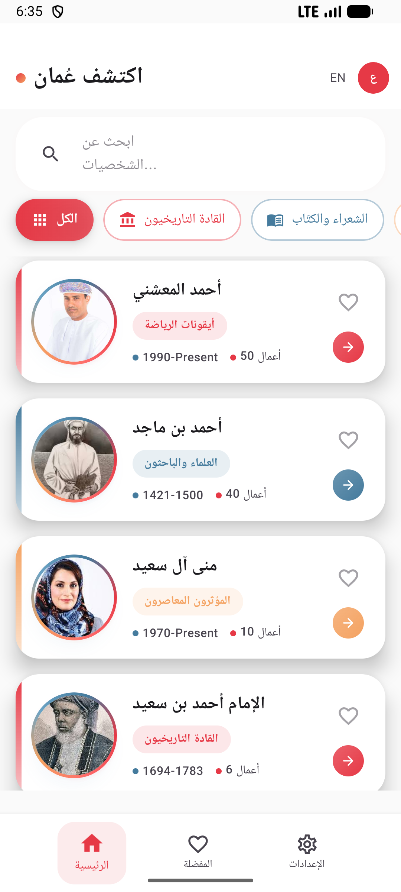
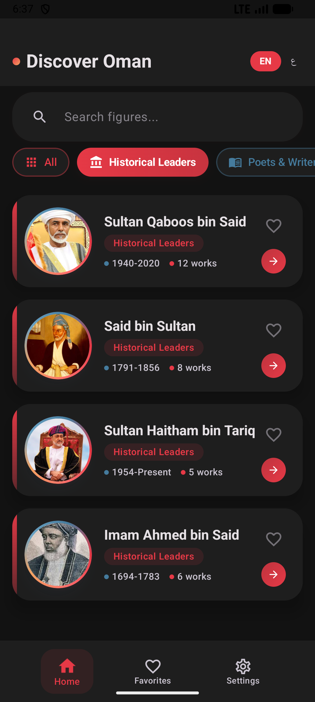

# Oman Culture App

A comprehensive Android application showcasing Oman's rich cultural heritage through famous Omani figures across different categories.


## ✨ Features

- **Multi-language Support** - English and Arabic with full RTL layout support
- **Interactive Onboarding** - 4-page welcome flow introducing Oman's heritage
- **Browse Famous Figures** - 20 carefully curated Omani figures across 6 categories
- **Detailed Profiles** - Biographies and achievements for each figure
- **Favorites System** - Save figures locally with DataStore
- **Modern Material 3 Design** - Clean, polished UI with custom theming
- **Smooth Animations** - Card transitions, gradient avatar borders, and more
- **Search Functionality** - Find figures by name
- **Category Filtering** - Filter by Historical Leaders, Poets, Artists, Sports, Scholars, Modern Influencers
- **Dark Mode** - Full dark theme support

## 📱 Screenshots

|                           Onboarding                            |                        Home Screen                        |                       Category Filter                       |
| :-------------------------------------------------------------: | :-------------------------------------------------------: | :---------------------------------------------------------: |
|  |  |  |

|                        Detail Screen                        |                           Favorites                            |                           Settings                            |
| :---------------------------------------------------------: | :------------------------------------------------------------: | :-----------------------------------------------------------: |
|  |  |  |

|                         Arabic RTL                          |                         Dark Mode                         |
| :---------------------------------------------------------: | :-------------------------------------------------------: |
|  |  |

## 🏗️ Architecture

The app follows **MVVM (Model-View-ViewModel)** architecture:

```text
app/src/main/java/com/oman/culture/
├── MainActivity.kt
├── OmanCultureApp.kt
├── data/
│   ├── local/
│   │   └── FavoritesDataStore.kt
│   ├── model/
│   │   ├── Figure.kt
│   │   └── Category.kt
│   └── repository/
│       └── FiguresRepository.kt
├── ui/
│   ├── theme/
│   ├── navigation/
│   ├── components/
│   └── screens/
│       ├── onboarding/
│       ├── home/
│       ├── detail/
│       ├── favorites/
│       └── settings/
└── localization/
    └── LocaleManager.kt
```

## 🛠️ Tech Stack

| Technology                | Purpose                                 |
| ------------------------- | --------------------------------------- |
| **Kotlin**                | Modern programming language for Android |
| **Jetpack Compose**       | Declarative UI framework                |
| **Material 3**            | Latest Material Design components       |
| **Navigation Compose**    | Type-safe navigation                    |
| **ViewModel & Lifecycle** | State management                        |
| **Coil**                  | Image loading with caching              |
| **DataStore Preferences** | Local storage for favorites             |
| **Compose Icons**         | Material Icons Extended & Feather Icons |

## 🎨 Design System

| Color            | Hex       | Usage                             |
| ---------------- | --------- | --------------------------------- |
| Primary Red      | `#E63946` | Main accent, headers, CTAs        |
| Secondary Blue   | `#457B9D` | Secondary accent, category colors |
| Tertiary Orange  | `#F4A261` | Highlights                        |
| Background Light | `#FAFAFA` | Light theme background            |
| Background Dark  | `#121212` | Dark theme background             |

## 📂 Categories

1. **Historical Leaders** - Sultans and rulers who shaped Oman's history
2. **Poets & Writers** - Literary figures who enriched Omani culture
3. **Artists & Musicians** - Creative talents in arts and music
4. **Sports Icons** - Athletes who brought glory to Oman
5. **Scientists & Scholars** - Academics and researchers
6. **Modern Influencers** - Contemporary figures shaping modern Oman

## 🚀 Getting Started

### Prerequisites

- Android Studio Hedgehog (2023.1.1) or later
- JDK 11 or higher
- Android SDK 24+ (minSdk)

### Installation

1. Clone the repository:

   ```bash
   git clone https://github.com/gheith3/oman-culture-app.git
   ```

2. Open the project in Android Studio

3. Sync Gradle and run on an emulator or device

### Build

```bash
./gradlew assembleDebug
```

## 📄 Dependencies

```kotlin
// Core
implementation("androidx.core:core-ktx")
implementation("androidx.lifecycle:lifecycle-runtime-ktx")
implementation("androidx.activity:activity-compose")

// Compose
implementation(platform("androidx.compose:compose-bom"))
implementation("androidx.compose.ui:ui")
implementation("androidx.compose.material3:material3")
implementation("androidx.navigation:navigation-compose")

// Image Loading
implementation("io.coil-kt:coil-compose")

// DataStore
implementation("androidx.datastore:datastore-preferences")

// Icons
implementation("androidx.compose.material:material-icons-extended")
implementation("br.com.devsrsouza.compose.icons:feather")
```

## 👨‍💻 Developer

- **Name:** Gheith ALRawahi
- **Student ID:** 2120246006

## 📝 License

This project is for educational purposes.

---

Made with ❤️ for Oman
